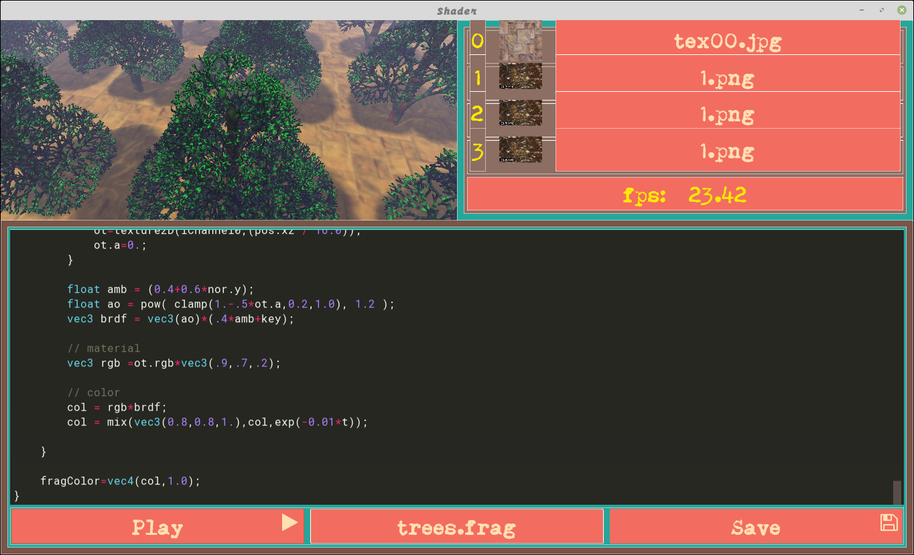

# kivy-shadertoy

Based on old abandoned version (which doesnt work!) of tshirtman (https://github.com/tshirtman) . Modified to work with new version of kivy and added more stuffs and enhanced GUI ! also added mouse and camera view control.
Many shaders examples adopted from shadertoy site to work with this shadertoy. 
The shaders are in the glsl folder.  
  
  

  ## To do !
- buffers!!
